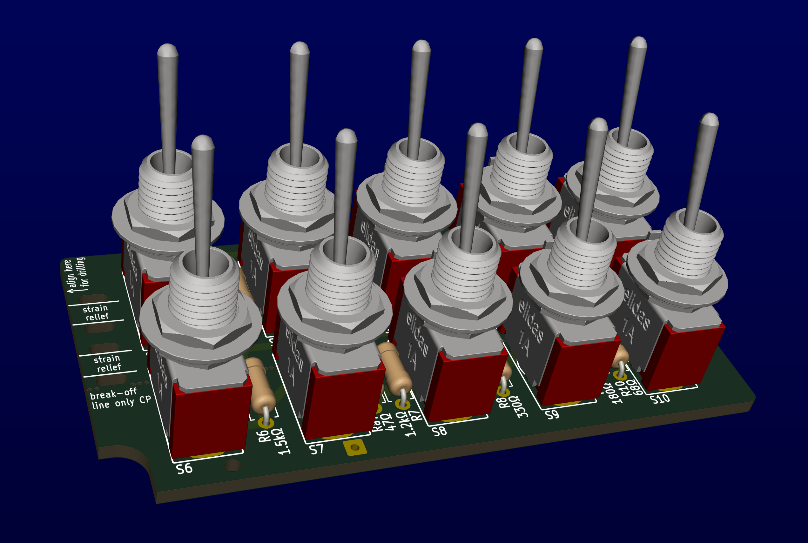
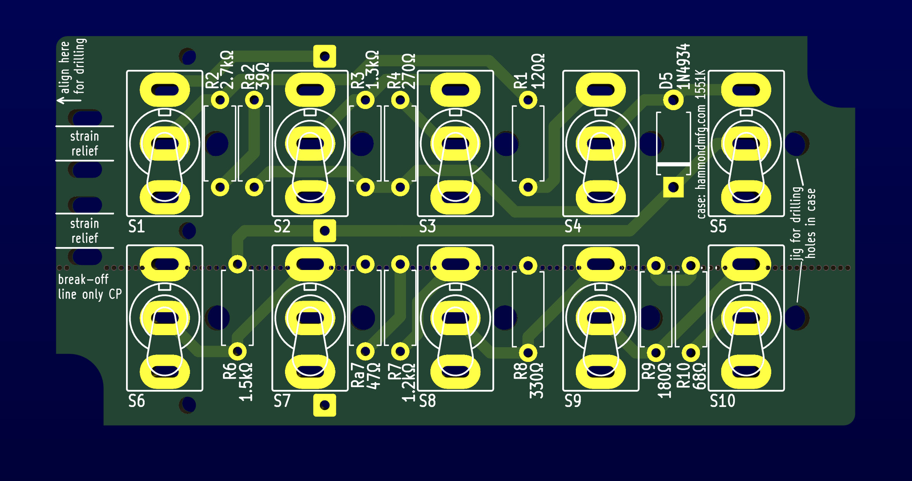
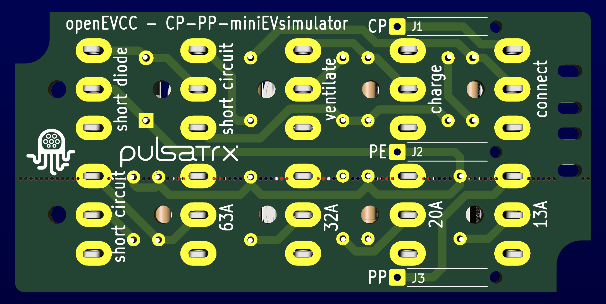
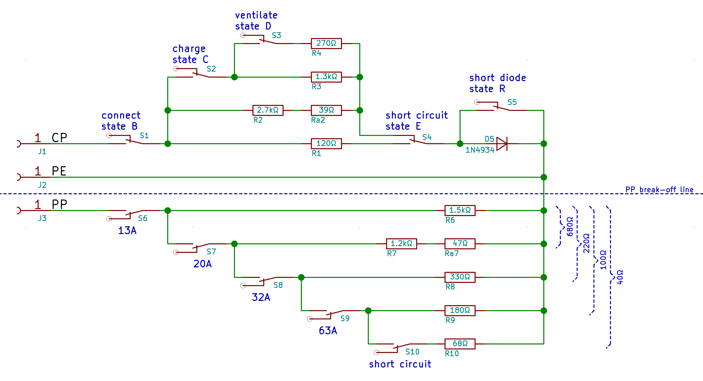

# CP-PP-miniEVsimulator
This is a small PBC to simulate the CP signal of an electric vehicle (EV) and the PP signal of the IEC 62196 type 2 or SAE J1772 type 1 plug according to IEC 61851.

[PDF Schematic](CP-PP-miniEVsimulator.pdf)

## CP signal
The EV shows different resistor values to signal its status.
5 miniature toggle switches allow to simulate the CP signal for following EV states:
| status | S1  | S2  | S3  | S4  | S5  | description         |
| ------ | --- | --- | --- | --- | --- | ------------------- |
| A      | off |  x  |  x  |  x  |  x  | EV disconnected     |
| B      | on  | off |  x  | off | off | EV connected        |
| C      | on  | on  | off | off | off | charging request    |
| D      | on  | on  | on  | off | off | ventilation request |
| E      | on  |  x  |  x  |  on | off | short circuit       |
| R      | on  |  x  |  x  |  x  | on  | diode shorted       |

## PP signal
Different resistor values in the connector on each side fo the charging cable signal the EVSE and the EV the ampaticity of the cable, to avoid an overload condition.
Another 5 toggles switches allow to simulate the PP signal for the following cable ampacities:
| ampacity     | S6  | S7  | S8  | S9  | S10 |
| ------------ | ----| --- | --- | --- | --- |
| disconnected | off |  x  |  x  |  x  |  x  |
| 13A          | on  | off |  x  |  x  |  x  |
| 20A          | on  | on  | off |  x  |  x  |
| 32A          | on  | on  | on  | off |  x  |
| 63A          | on  | on  | on  | on  | off |
| short        | on  | on  | on  | on  | on  |

The PP part of the PCB can be broken off to reduce PCB size when the PP simulation is not nedded.

### Bill of materials
| designator | value   |
| ---------- | ------- |
| R1         |   120Ω  |
| R2         |  2.7kΩ  |
| Ra2        |    39Ω  |
| R3         |  1.3kΩ  |
| R4         |   270Ω  |
| D5         | 1N4934  |
| R6         |  1.5kΩ  |
| R7         |  1.2kΩ  |
| Ra7        |    47Ω  |
| R8         |   330Ω  |
| R9         |   180Ω  |
| R10        |    68Ω  |
| S1,S2,S3,S4,S5,S6,S7,S8,S9,S10 | miniature Toggle switch |
| case       | hammond 1551K |
|            | 2mm zip tie  |
